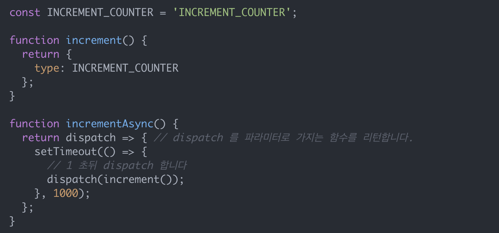

# ch18. 리덕스 미들웨어

## 리덕스는 순수해야한다

### 1. 사이드이펙트(API를 호출하거나 지역객체, 지역변수가 아닌 것을 수정하는 등)가 생기면 안됩니다.

### 2. 순수하지 않은 함수(Date.now 혹은 Math.random와 같은)를 호출하면 안됩니다.

### 3. 인수를 변경하면 안 됩니다. 리듀서가 상태를 변화시킬 때 이미 존재하는 상태 객체를 수정하면 안됩니다. 그 대신 변화에 필요한 새로운 객체를 만들어야 합니다. 리듀서가 업데이트하는 상태 내의 모든 객체에 동일한 접근이 필요합니다.


## 비동기 작업(ex: 네트워크 요청)을 하고 싶을 경우 손쉽게 상태관리를 하기위해 사용한다. <br/> 액션이 리듀서에 전해지기전 작업을 한 후 전하고 싶을 떄 사용

### redux-thunk

thunk 란?

thunk란 특정 작업을 나중에 하도록 미루기 위해서 함수형태로 감싼 것을 칭합니다.

```javascript

const num = 1*2 ;

const foo() => 1*2

// 연산은 함수가 실행되어야만 일어나게된다.
```

원래 액션 함수의 경우 액션객체를 반환해주는 것인데, thunk를 사용하면
함수를 생성하는 액션생성 함수를 만들어준다.

> 일반 액션함수의 경우 객체만 반환하는 형식

```javascript
const increase = num => ({
  type: INCREASE,
  num
});
```



> 미들웨어 없이 1초뒤 액션을 실행하는 예제<br/>
> store.dispatch(incrementAsync());라고 호출하면 INCREMENT_COUNTER 액션이 1초뒤에 디스패치됩니다.
